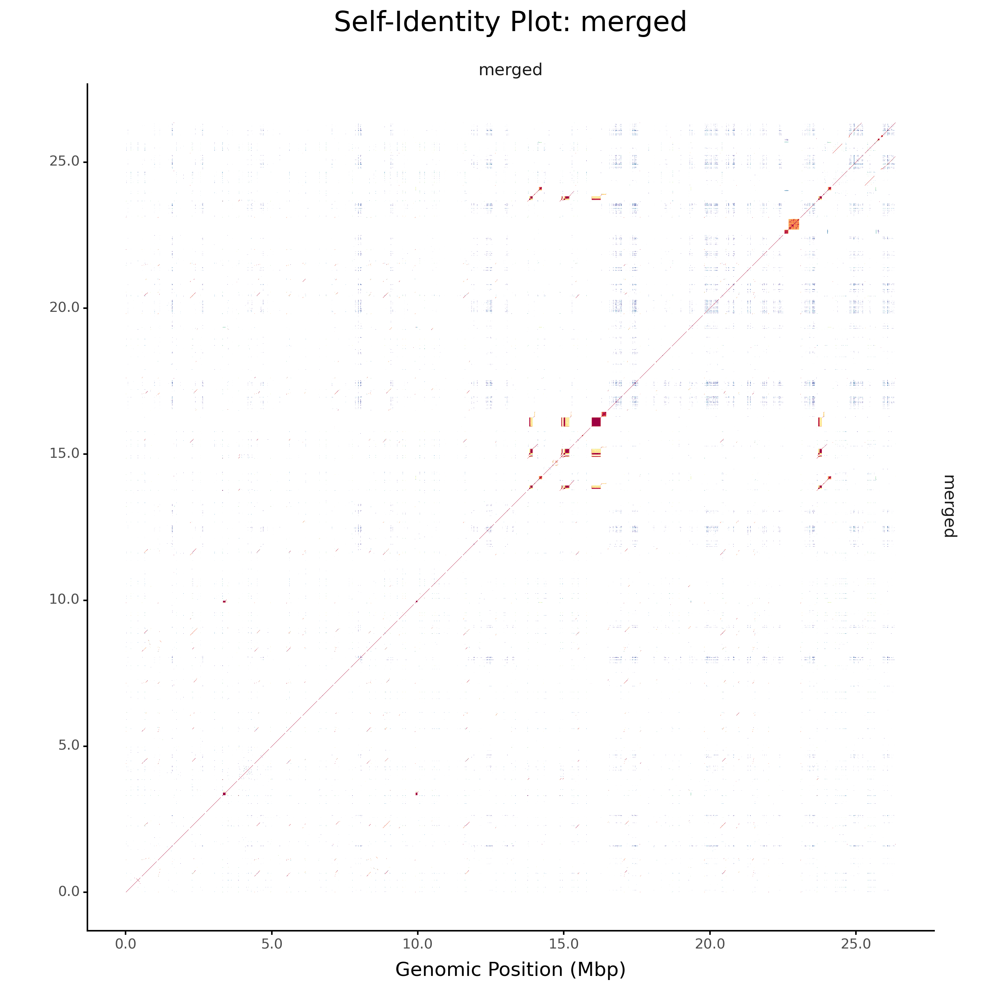
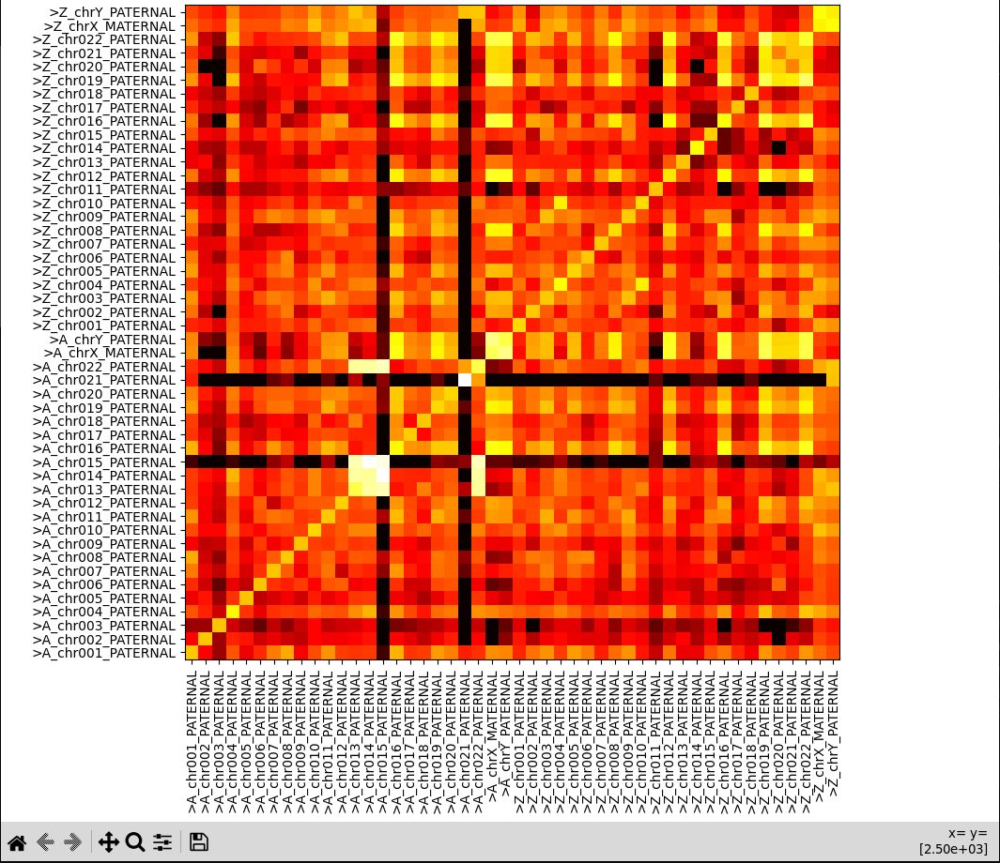
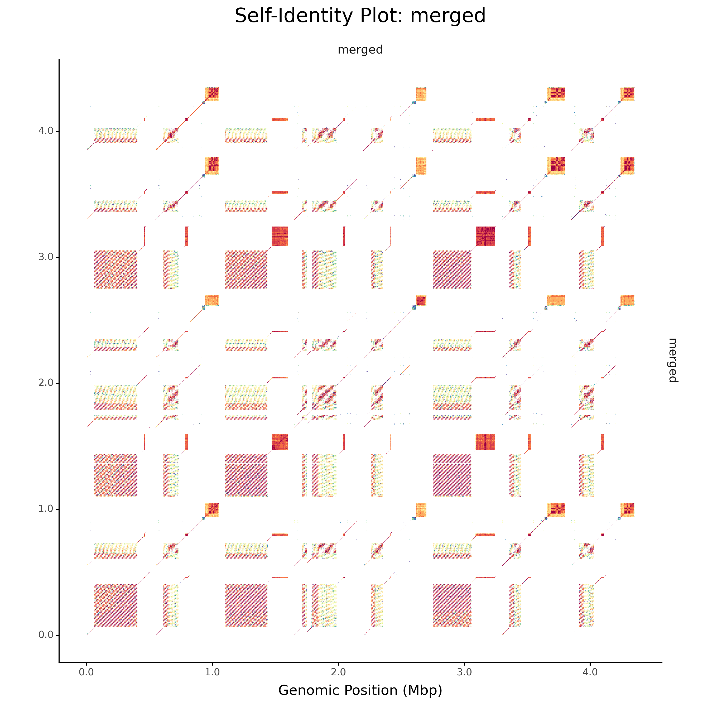
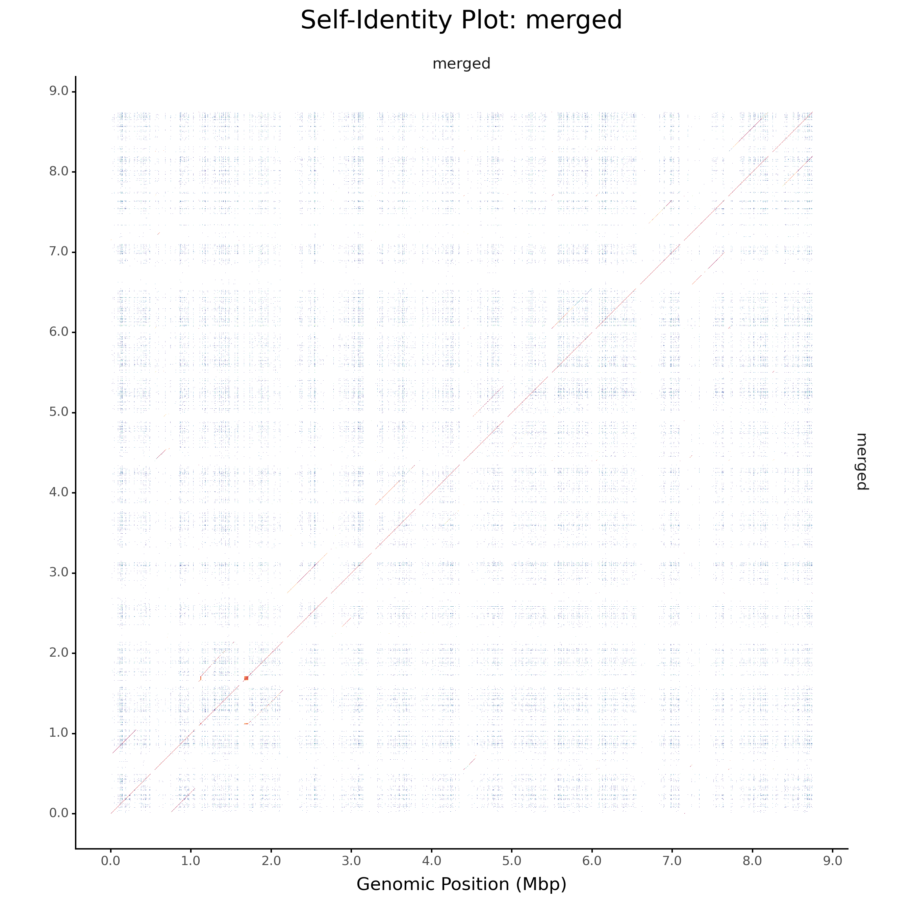
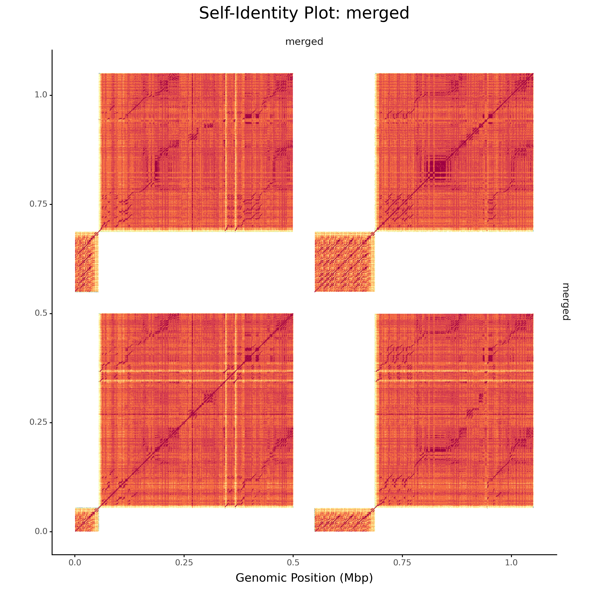

# Comparing subtelomeric sequences in human genomes in terms of sequence similiarity

525183, Jindřich Matuška

## Abstract

Subtelomeres are parts of DNA close to the telomeres. They are defined
as segments between telomeric sequences and chromatin, in humans they are
usually considered 500Kbp from each telomere.
Subtelomeres are sequences with high similiarity. They contain autonomously
replicating sequence, tandem repeats and more. This allows for change in
length of individual chromosomes, creation of space for de-novo genes etc.

In this project I explore similiarity between individual subtelomeres.
First I create a pipeline for easy and efficient extraction of subtelomeres. 
Then I look into possibilities of similiarity analysis using tool ModDotPlot
with the help of custom script for generating heatmaps from resulting `.bedpe`
file. Finally I introduce a method for searching for frequent sequences
using combination of approaches such as markov model using graph of kmeres
and great deluge.

Each part of this report contains a sample script, which may be used for running
the tools and pipelines. Created tools are also documented both using `-h` option
and inside scripts.

## Project repository: getting started

This project has an corresponding repository under following link:

[github.com/Ardnij123/pv269_project](https://github.com/Ardnij123/pv269_project)

To prevent the repository being too large, the analysed sequence has not been
uploaded to it. You can either use your own sequences or download one. I have
worked with sequence HG002v1.1 [1]. The sequence should be a telomere-to-telomere
sequence in high quality. For use with `repeats.py`, it is prefered to not
contain any N's. Similiarly, most of intermediate results are not uploaded
to the repository.

Most of the tools used can be downloaded using Conda. The list as an installation
script can be found at
[.conda_files/conda_crete.sh](https://github.com/Ardnij123/pv269_project/blob/main/.conda_files/conda_create.sh) [2-5].
Other than that, I have used package ModDotPlot [6], which may be either directly
installed or used for instance as Docker image,
[for instance this one](https://hub.docker.com/r/jindmen/moddotplot).

## Subtelomere extraction

```Bash
# Extract subtelomeres of size 500Kbp in file hg002v1.1.fa.gz
# and write it into file subtelomeres.fa
./work/get_subtelomeres/extract_subtelomeres.sh -n 500000 -o subtelomeres.fa
```

I have created a pipeline for the extraction of subtelomeres. The pipeline
consists of filtering out telomeric sequences, cropping, reversing end sequences
and optionally extracting and rebasing a bedfile to correspond to the sequence
names in the resulting fasta file. The script is parametrized to allow for
extraction of any-length telomere sequence or use existing file with sizes of
chromosomes for better performance.

Full pipeline can be found at
[work/get_subtelomeres/extract_subtelomeres.sh](https://github.com/Ardnij123/pv269_project/blob/main/work/get_subtelomeres/extract_subtelomeres.sh).
Tools such as SeqKit [2], BEDTools [3] or Seqtk [4] are leveraged for most of the work.
Scripts in Python or Bash are used for the remainder of steps.

The pipeline is quite fast (at least compared to other steps in this project).
By far the slowest part is gaining chromosome sizes.
One feature it lacks is that it does not check if there is any telomere sequence.
This may lead to addition of unwanted sequence from not-the-subtelomere into
the output.

## Graph of similiarity using ModDotPlot, heatmap and groups

```Bash
mkdir plot-full

# Merge sequences
./work/similiarity-plot/merge_split.sh subtelomeres.fa -o plot-full/merged.fa

# Run ModDotPlot in low resolution (window 5Kbp)
moddotplot static -f merged.fa -o plot-full/w5000 -w 5000 --no-plot --no-hist

# Visualise the bedpe file
./work/similiarity-plot/event_counter.py plot-full/w5000/merged.bedpe \
        -s plot-full/merged.fa.seqs

# Select promissing sequences and plot in high res (window 1Kbp)
mkdir group_1
merge_split.sh subtelomeres.fa \
        -p chr1_.*_START -p chr4_.*_START -p chr7_.*_END \
        -r "s/^>(.*)_END/>Z_\1/" -r "s/^>(.*)_START/>A_\1/" \
        -o group1/merged.fa
moddotplot static -f group1/merged.fa -o group1/w1000 -w 1000
```

For exploration of similiarity I have first used ModDotPlot [6]. ModDotPlot takes
several fasta files on the input and approximates the average nucleotide identity
between pairwise combinations of genomic intervals (tldr. it creates a hit
heatmap for the files). I have written some notes on running ModDotPlot
into
[work/similiarity-plot/moddotplot.md](https://github.com/Ardnij123/pv269_project/blob/main/work/similiarity-plot/moddotplot.md).

ModDotPlot seems to have options for plotting allignment of multiple sequences
in a grid. I have however not found a way to make it grid more than 4 sequences
at once. For this I have created tiny script that merges multiple sequences into
one, splitting them with a sequence of N's. This way, the graph generated by
ModDotPlot is more readable.

The ModDotPlot seems to scale with the number of genomic intervals. It is best
to first create a plot with low resolution, then choose some subset of sequences
that seems to be promissing (eg. subset with high number of similiar intervals)
and only create plot in higher resolution for this subset.



At least in the first allignment of all subtelomeres, the resulting plot might
be quite large and hard to comprehend (see Figure 1).
To make the reading of it easier, I have
created a Python script that plots the identities as a heatmap using Matplotlib.
It also allows for turning on/off some sequences to better see the groups (see Figure 2).
The script can be found at [work/similiarity-plot/event_counter.py](https://github.com/Ardnij123/pv269_project/blob/main/work/similiarity-plot/event_counter.py)



With output plotted in this way it is up to the human behind the computer to
choose some groups of sequences for further examination. In this case, it seems
to me that there are 2 groups of high similiarity, that is:

1) starts of chromosomes 13, 14, 15 and 22 (see Figure 3)
2) starts of 16, X, Y and ends of 8, 12, 16, 19, 20, 22 (see Figure 4)

Other than that, start of the chromosome 21 has a high self-similiarity (see Figure 5).







## Alligning sequences

ModDotPlot outputs besides the images a `.bedpe` file, which contains the hits
in a format similiar to the `bed` format, which makes extraction of the hit
sequences from the full DNA file easy. I have tried to allign the hits using
ClustalO [7], however it ran very slow and in the end it failed. My assumption
is that it was due to the very large number of short sequences. With better choice
of alligner I would assume this could lead to quite easy extraction of the backbone
of repeating sequences.

For script, see [work/repeat-search/allignment.sh](https://github.com/Ardnij123/pv269_project/blob/main/work/repeat-search/allignment.sh)

## Sequences with high frequency

```Bash
./work/repeat-search/repeats.py subtelomeres.fa \
        -k 20 -t 5 -i 10 -g 10 -b 3 -s 0 -e 12 -m 500 > repeats.bed
```

Finally, I have implemented my own algorithm for seeking subsequences with high
frequency. This algorithm is based on markov chain and great deluge algorithm.
First, it creates a graph with kmeres as nodes and counts of transitions by reading
single base as weights of edges. This graph is then scaled logarithmically and pruned
for better performance. Weights then correspond to increments of score
gained by passing through the edge (by reading the corresponding base).
In the second run, the graph is used to find the path in it with the highest
score. With some penalties gaps and insertions are allowed to model possible
modifications to the DNA sequence.

```
Init:
Graph G, V(G) - states of automaton, E(G) allowed transitions by reading sequence
    weights of edges correspond to increment of value by moving along the edge
Sequence corresponding to the graph

Parameters:
MaxDrop, InsertionPenalty, GapPenalty, BasePenalty

1) Values[0] := {(v: 0) for v in V(G)}; Starts[0] := {(v: 0) for v in V(G)};
   MaxValue := 0; MaxPosition = 0; MinPosition = 0; Position = 0

2) Do {
    Position := Position + 1
    Base := following base on input

    Set Value[Position][v] to maximum of:
        ( Value[Position-1][v] - InsertionPenalty )
        ( Value[Position-1][v-1] - GapPenalty )
            if v-1 is node with edge comming to v
        ( Value[Position-1][v-1] + weight of the transition edge )
            if v-1 is node with edge comming to v corresponding to Base

    Values[Position] := Values[Position] - BasePenalty
    Set Starts[Position] according to the states

    For each State v s.t. Values[Position][v] <= 0; Do
        Values[Position][v] = 0
        Starts[v] = Position
    Done

    Score := max(Values)
    If MaxValue < Score; Then
        MaxValue := Score
        MaxPosition := Position
        MinPosition := Starts[argmax(Values)]
    Fi

    Optionally: Remove states v from Values where Values[v] < MaxValue - MaxDrop

} While Score >= MaxValue - MaxDrop  

Return MinPosition, MaxPosition, MaxValue
```

For example with k=3 and sequence `AATTAATAATTA`, there are 5 distinct kmeres
`AAT, ATT, TTA, TAA, ATA`. In the graph, the counts on the edges would be:

```
AAT - ATT - 2
ATT - TTA - 2
TTA - TAA - 1
TAA - AAT - 2
AAT - ATA - 1
ATA - TAA - 1
```

The values would then be rescaled using logarithmic scale, and the low ones
would be removed (e.g. edges with count 1).

The search algorithm for the second run then reads bases one by one and in each
step it computes best possible values for all nodes (kmeres) in the graph,
down to some minimal value (it is called `_flood` in the implementation).
In each step and node, it also has 3 possible things to do.
Either it reads a correct base, in which case it simply adds the weight
of the edge to the previous value of node and uses it as new value of
the next node. Or there might have been an insertion into the DNA,
which means that it subtracts the insertion penalty of the node
and uses it as a new value for the node. The third case could be
that there was some deletion from the DNA, which corresponds to transition
in the graph without reading base.

The implementation contains many optimalisations such as starting only
on exact match of given length, evaluation of nodes in order by descending
score to not expand one node multiple times or using arrays for values
over and over to mitigate reinitialization of them for each step.
The results are more or less stable with respect to the parameters.

In the current state, it however does only print out the subsequences
with frequent kmeres, not the corresponding probable sequence before mutations.
It should not be hard to implement, but it is too close to the deadline.
Also, it should be possible to drastically lower the memory consumption
when creating the graph of kmeres. (Currently it takes close to 16GB of memory
for 72Mbp fasta file, but after the prunning and change of representation it
goes below 2GB.)

Program prints out sequence of lines similiar to `bed` format (except there is
score in 4th column instead of 5th one).

Result of search on 800Kbp subtelomeres with parameters as above may be found
at [data/hg002/repeats_800k](https://github.com/Ardnij123/pv269_project/blob/report/data/hg002/repeats_800k.bed).
High scores towards proximal ends of subtelomeres might suggest that setting
subtelomere length to 500Kbp might not be enough.

## References

[1] Rhie A, et al. The complete sequence of a human Y chromosome. Nature, 2023.
Can be downloaded at [s3-us-west-2.amazonaws.com/human-pangenomics/T2T/HG002/assemblies/hg002v1.1.fasta.gz](https://s3-us-west-2.amazonaws.com/human-pangenomics/T2T/HG002/assemblies/hg002v1.1.fasta.gz)

[2] Wei Shen, Botond Sipos, and Liuyang Zhao. 2024. SeqKit2: A Swiss Army Knife for Sequence and Alignment Processing. iMeta e191. doi:10.1002/imt2.191.

[3] Quinlan AR and Hall IM, 2010. BEDTools: a flexible suite of utilities for comparing genomic features. Bioinformatics. 26, 6, pp. 841–842.

[4] Seqtk. https://github.com/lh3/seqtk

[5] ImageMagick. https://imagemagick.org/index.php

[6] Alexander P Sweeten, Michael C Schatz, Adam M Phillippy, ModDotPlot—rapid and interactive visualization of tandem repeats, Bioinformatics, Volume 40, Issue 8, August 2024, btae493, https://doi.org/10.1093/bioinformatics/btae493

[7] Sievers F, Barton GJ, Higgins DG (2020) Multiple Sequence Alignment. Bioinformatics 227, pp 227-250, AD Baxevanis, GD Bader, DS Wishart (Eds) 
